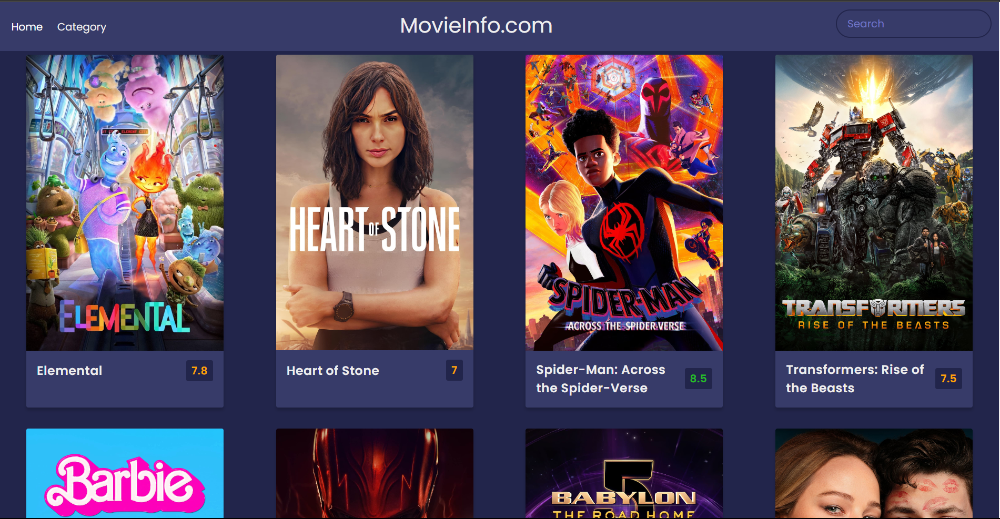
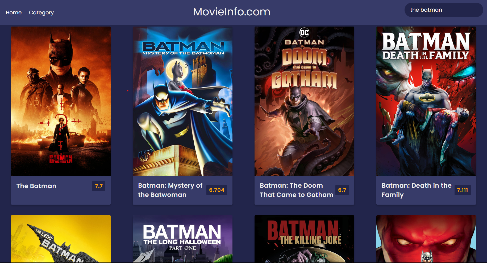
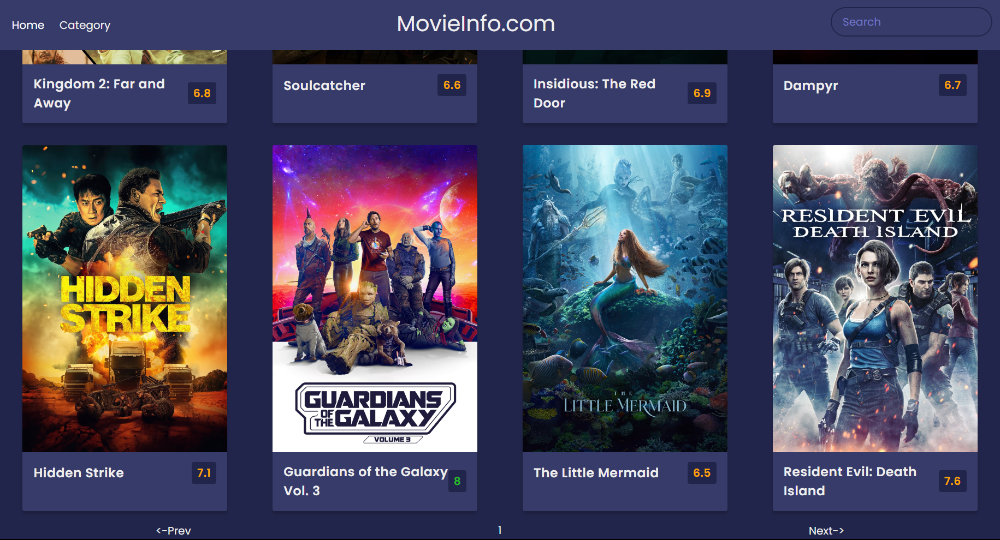

# Movie Info Website

## Table of Contents

1. [Brief Description](#brief-description)
2. [Screenshots](#screenshots)
3. [Demos](#demos)
4. [API Reference](#api-reference)
5. [Environment Variables](#environment-variables)
6. [Features](#features)
7. [Feedback](#feedback)

## Brief Description

This project allows us to view a wide range of now-playing, popular, top-rated, and upcoming movies. This project also allows us to view the overviews and ratings of each movie in any category. There is no limit to search a movie and know about it, because there are previous and next page options which enables you to travel to find new movies with each click.

This project is build using HTML, CSS and JavaScript. Using JavaScript enabled me to access the response send by the TMDb API and use for developing this project.

## Screenshots

Movie Info Website Home Page

Movie Search

Previous and Next options

## Demos

Categories dropdown

Overview of a movie

Previous and next pages

Movie search

## API Reference

This project is done with the TMDb API.

[API Reference](https://developer.themoviedb.org/reference/intro/getting-started)

## Environment Variables

To run this project, you must get your own API key from the TMDb site.

[Get your API key](https://www.themoviedb.org/settings/api)

## Features

- Four categories - Now Playing, Popular, Top Rated, and Upcoming
- Contains Movie Overview and its Average Rating
- Previous and Next pages to discover a wide range of available movies

## Feedback

If you have any feedback, please reach out to ramcharanvakkalanka@gmail.com
